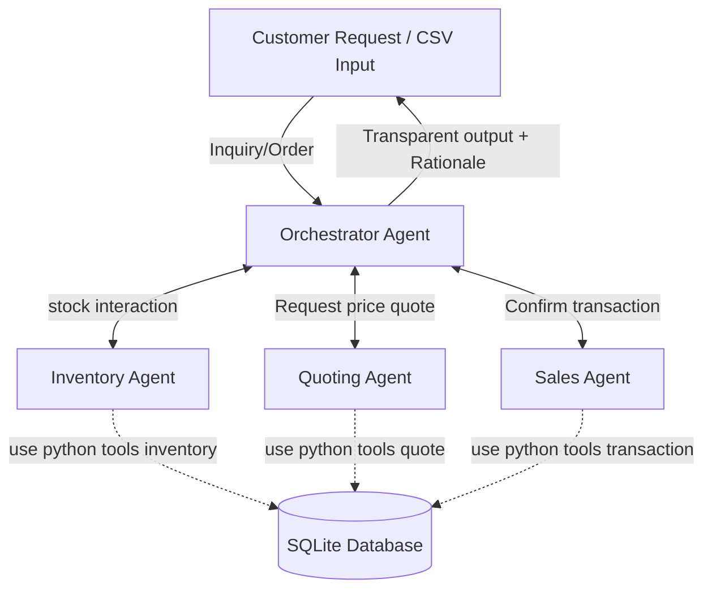
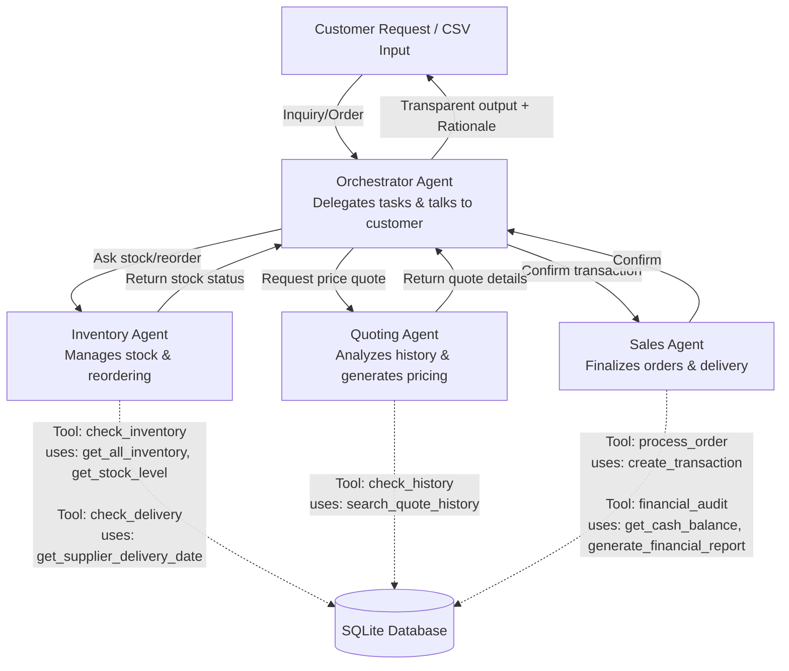

# udacity-project-beavers-paper-ai-system

udacity project multi-agent system for The Beaver's Choice Paper Company. **Munder Difflin Paper Company Multi-Agent System Project**

multi-agent system that supports core business operations at the fictional paper manufacturing company

## Modular multi-agent system

- **Inventory checks** and restocking decisions
- **Quote generation** for incoming sales inquiries
- **Order fulfillment** including supplier logistics and transactions
- DB contains Historical quote data, Incoming customer requests and company synthetic information.

## getting started

- using [uv](https://docs.astral.sh/uv/#the-pip-interface) but feel free to use `pip` or any other python package manager

### inject secrets to a target directory

- leverage onePassword with service account token Win Powershell

   ```powershell
   $OP_SERVICE_ACCOUNT_TOKEN="token from 1Password.com"
   ```

- leverage onePassword with service account token linux Bash

   ```shell
   export OP_SERVICE_ACCOUNT_TOKEN="token from 1Password.com"
   ```

- inject the secrets. `.gitignore` includes required `.env` records

   ```powershell
   op inject --in-file .env.tpl --out-file .env
   ```

### python dependencies & packages

- Install dependencies

    ```fish
    uv venv
    ```

- prepare the python packages

    ```bash
    uv pip sync requirements.txt
    ```

- Activate with:

    ```bash
    source .venv/bin/activate
    ```

- functionality similar to rye or poetry

    ```bash
    uv add ruff
    ```

- validation

    ```bash
    uv run ruff check
    ```

### Smoke test & general execution

- execute the multi agent system

    ```bash
    uv run beavers_choice_multi_agent_system.py
    ```

## Diagrams Designs

### Agent Workflow Diagram

High level design

[Mermaid](https://mermaid.live/)



### Agent implementation details

Comprehensive Tool Mapping to all agents and tools



---

## Submission Checklist

Make sure to submit the following files:

1. Your completed `template.py` or `project_starter.py` with all agent logic
2. A **workflow diagram** describing your agent architecture and data flow
3. A `README.txt` or `design_notes.txt` explaining how your system works
4. Outputs from your test run (like `test_results.csv`)

---
