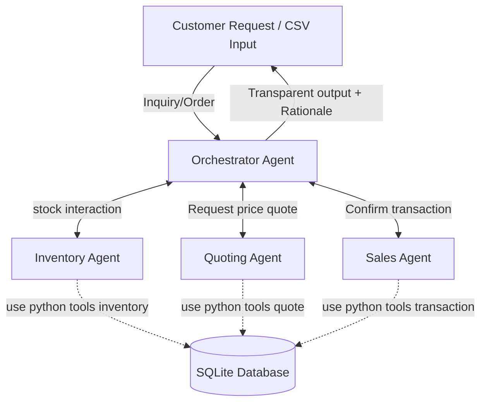
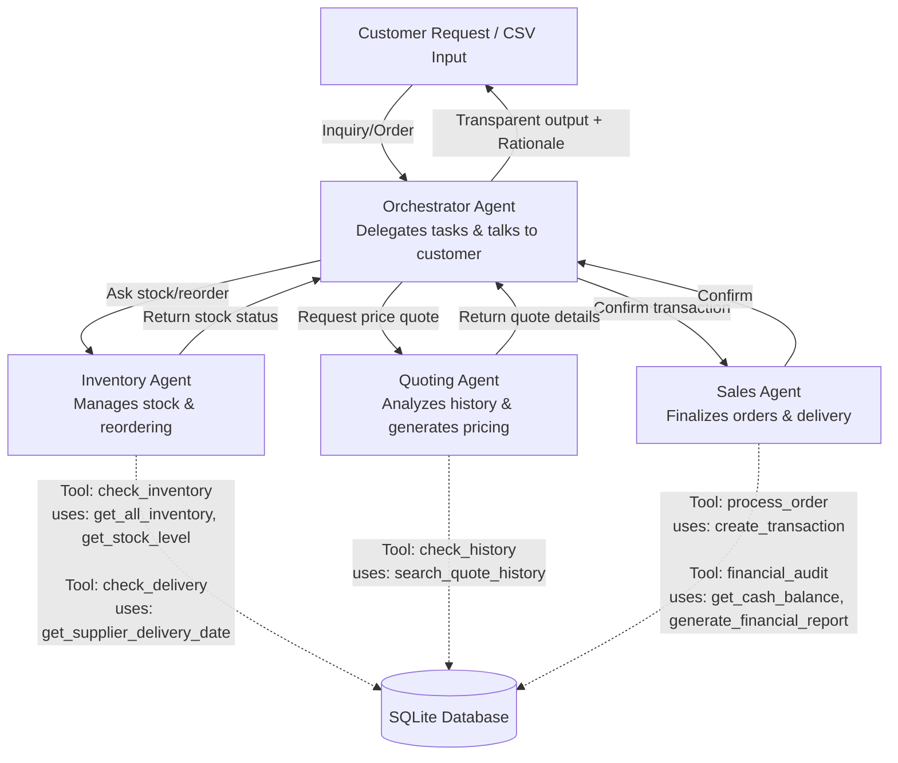

# udacity-project-beavers-paper-ai-system

udacity project multi-agent system for The Beaver's Choice Paper Company

## Agent Workflow Diagram

High level design

[Mermaid](https://mermaid.live/)

## Agent implementation details

Comprehensive Tool Mapping to all agents and tools

